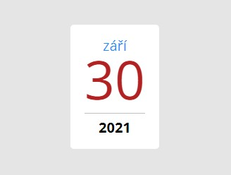

# Cvičení 2 - Datumy

Vytvoř v Reactu stránku, která bude zobrazovat různé datumy.

1. Založ si nový React projekt pomocí `create-czechitas-app` a nazvi ho třeba `datumy`. Vymaž výchozí obsah ukázkové aplikace.

1. Vytvoř komponentu `Date`, která bude očekávat tři props:
	- `day` - řetězec s číslem dne (např. `16`)
	- `month` - řetězec s názvem měsíce (např. `červen`)
	- `year` - řetězec s číslem roku (např. `2021`)

	Komponenta by měla zobrazit datum ve formátu `16. červen 2021`. Každou položku datumu zabal do elementu `span` nebo `div` a každé přidej vlastní CSS třídu, abys mohla jednotlivé části data nestylovat.

1. Vytvoř komponentu `App` a umísti do ní třikrát komponentu `Date`, pokaždé s jiným datumem.

1. Svoje CSS třídy nastyluj, aby den byl červenou barvou, měsíc aby byl modře a rok tučně.

1. Pokud máš vše hotovo a máš chuť si hrát, můžeš komponentu nastylovat, aby vypadala jako na obrázku:

	
