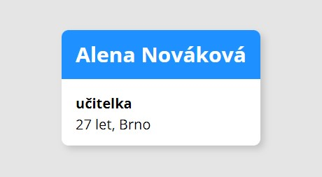

# Cvičení 3 - Kontakty

Vytvoř v Reactu komponentu pro zobrazování kontaktů.

1. Založ si nový React projekt pomocí `create-czechitas-app` a nazvi ho třeba `kontakty`. Vymaž výchozí obsah ukázkové aplikace.

1. V **samostatné složce** vytvoř komponentu `Contact`, která bude očekávat čtyři props:
	- `name` - řetězec se jménem (např. `Alena Nováková`)
	- `job` - řetězec s pracovní pozicí (např. `učitelka`)
	- `age` - řetězec s věkem (např. `27`)
	- `city` - řetězec se jménem města (např. `Brno`)


	Komponenta by měla zobrazit údaje zhruba v takovéto struktuře:
	```html
	<div class="contact">
		<h2 class="contact__name">Alena Nováková</h2>
		<p class="contact__job">učitelka</p>
		<p class="contact__info">27 let, Brno</p>
	</div>
	```

1. Vytvoř komponentu `App` a umísti do ní několik různých kontaktů.

1. Pro komponentu vytvoř **její vlastní** CSS soubor a nastyluj komponentu tak, aby celý kontakt byl v rámečku a jméno bylo modře a tučně.

1. Pokud máš vše hotovo a máš chuť si hrát, můžeš komponentu nastylovat, aby vypadala jako na obrázku:

	
